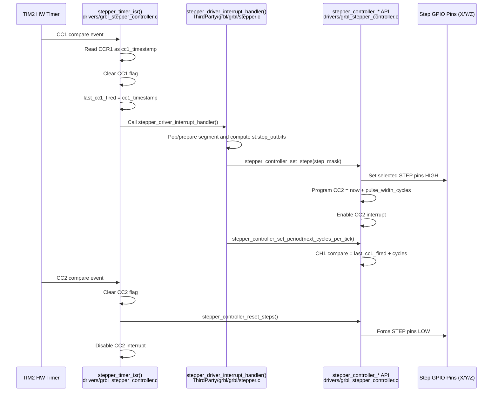

## Summary
This project has migrated the GRBL pulse engine from a FreeRTOS-based, STM32 register/DMA-coupled implementation into a Zephyr-aligned, interrupt-driven architecture.

In the current design:
- Real-time step timing is executed by timer interrupts.
- Motion logic remains in GRBL (`stepper.c`).
- Hardware control is delegated to a Zephyr device driver (`grbl_stepper_controller.c`).

## Core Architectural Change (DMA -> ISR)
### Method Used in This Port
The step pulse engine is implemented as a timer-driven ISR pipeline:
- `CC1` compare interrupt triggers GRBL step computation (`stepper_driver_interrupt_handler`).
- GRBL computes direction/step outputs and requests pulse output through `stepper_controller_set_steps(...)`.
- Driver schedules pulse trailing edge on `CC2` using configured pulse width.
- `CC2` compare interrupt clears STEP pins through `stepper_controller_reset_steps(...)`.
- Next tick is scheduled with `stepper_controller_set_period(...)`, anchored to `last_cc1_fired + cycles`.

Note: step pin transitions are still executed in software, but they are timer-compare driven inside ISR context (not thread-level polling/bit-banging).

Representative flow from `drivers/grbl_stepper_controller.c`:

```c
if (LL_TIM_IsActiveFlag_CC1(cfg->timer_instance)) {
    uint32_t cc1_timestamp = cfg->timer_instance->CCR1;
    LL_TIM_ClearFlag_CC1(cfg->timer_instance);
    data->last_cc1_fired = cc1_timestamp;
    stepper_driver_interrupt_handler();
}

if (LL_TIM_IsActiveFlag_CC2(cfg->timer_instance)) {
    LL_TIM_ClearFlag_CC2(cfg->timer_instance);
    stepper_controller_reset_steps(dev);
    LL_TIM_DisableIT_CC2(cfg->timer_instance);
}
```

And from `ThirdParty/grbl/grbl/stepper.c` (Zephyr branch), the GRBL side computes and commits the next period in each interrupt cycle:

```c
stepper_controller_set_steps(stepper_dev, st.step_outbits);
...
stepper_controller_set_period(stepper_dev, next_cycles_per_tick);
```

Design consequence: period scheduling is anchored to the last CC1 fire timestamp (`last_cc1_fired`) rather than ISR exit time, reducing phase drift caused by ISR execution latency.

## Hardware Decoupling Strategy
### Responsibilities split
`ThirdParty/grbl/grbl/stepper.c`:
- Owns motion math, Bresenham stepping state, segment consumption, and direction/step masks.
- Decides *what* the next step outputs and period should be.

`drivers/grbl_stepper_controller.c`:
- Owns timer channel setup, compare interrupts, GPIO pulse emission/reset, pulse width timing, and concurrency guards.
- Executes *how* electrical pulses are produced on hardware.

This is the intended contract boundary for future maintenance.

### No more hard-wired register macros for output forcing
Legacy style behavior (for example, `FORCE_OC_OUTPUT_LOW`) is not used as a direct register macro path in the Zephyr control flow. Instead, hardware-level step output control is routed through driver APIs such as:

```c
void stepper_controller_clear_steps(const struct device *dev, uint16_t step_mask);
```

This keeps low-level GPIO forcing in one driver layer and avoids scattering register-side effects across motion logic.

### STM32 LL Usage Points
This port still uses STM32 LL APIs in timing-critical paths. Current usage is concentrated in:
- `drivers/grbl_stepper_controller.c`
    - Timer compare/interrupt control: `LL_TIM_IsActiveFlag_CC1`, `LL_TIM_ClearFlag_CC1`, `LL_TIM_OC_SetCompareCH1`, `LL_TIM_EnableIT_CC1`, `LL_TIM_DisableIT_CC2`
    - Timer base setup: `LL_TIM_SetPrescaler`, `LL_TIM_SetAutoReload`, `LL_TIM_EnableCounter`
    - RCC/reset helpers: `LL_APB1_GRP1_EnableClock`, `LL_APB1_GRP1_ForceReset`, `LL_APB1_GRP1_ReleaseReset`
- `ThirdParty/grbl/grbl/stepper.c`
    - Direction pin updates in ISR path: `LL_GPIO_SetOutputPin`, `LL_GPIO_ResetOutputPin`

Practical boundary:
- Portable layer: GRBL computes step/direction intent and timing targets (platform-agnostic logic).
- Hardware-dependent layer: driver + STM32 LL implement TIM/GPIO register-level behavior (MCU-specific dependency boundary).

## Hardware-Triggered Limits and Homing Safety
Limits are handled through a hardware-triggered path and enforced by `stepBlockAxis` during homing.

Core hook (`Core/Src/step.c`):

```c
void stepBlockAxis(uint8_t axis)
{
    if (axis >= N_AXIS) {
        return;
    }

    // Software-level mask: stop further step requests for this axis.
    sys.homing_axis_lock &= ~get_step_pin_mask(axis);

    // Hardware-level enforcement: immediately drive physical step low.
    if (device_is_ready(stepper_dev)) {
        stepper_controller_clear_steps(stepper_dev, get_step_pin_mask(axis));
    }
}
```

This path provides two layers of protection when a homing limit event occurs:
- Software layer: retain GRBL-native `sys.homing_axis_lock` masking so future step generation ignores the blocked axis.
- Hardware layer: explicitly force the physical step pin low via the driver, preventing a stale-high edge condition at the instant a limit switch is hit.

Why this matters: in homing edge cases, software masking alone can still leave a short-lived electrical high level if the pulse is already asserted. The immediate GPIO clear path reduces that risk and protects the motor driver stage.

Current behavior:
- Limit events are captured from hardware signals and routed into GRBL limit handling (`limits.c`).
- During homing approach, `stepBlockAxis(axis)` is invoked to block the affected axis immediately.
- The block action applies both logical masking (`sys.homing_axis_lock`) and physical output enforcement (`stepper_controller_clear_steps(...)`).
- This path is designed to stop additional pulses on the triggered axis without waiting for a task-level polling cycle.

Integration points:
- Limit logic entry: `ThirdParty/grbl/grbl/limits.c`
- Axis block hook: `Core/Src/step.c`
- Electrical step-line enforcement: `drivers/grbl_stepper_controller.c`

## Deprecated Legacy Logic: `stepIsPulseDataExhausted()`
This check belongs to the old DMA pulse-buffer model and is now legacy-only.

Current status:
- The Zephyr port uses timer-driven ISR step generation (no DMA pulse ring-buffer).
- Pulse starvation is not represented by `stepIsPulseDataExhausted()` in this architecture.
- If the symbol is kept for compatibility, it should remain a stub that returns `0` (false).

## Maintenance Notes
- Keep timing-critical GPIO/timer operations inside the driver layer; avoid reintroducing register writes into planner/stepper logic.
- Preserve the CC1-anchored scheduling rule (`last_cc1_fired + cycles`) when changing ISR behavior.
- Treat homing safety as a two-part invariant: logical axis lock + immediate electrical low-level enforcement.
- If future work adds TCP/remote control, avoid placing transport latency inside this timing path; isolate comms from step pulse generation.

### Step Pulse Runtime Sequence (ISR Model)



### Homing Safety Flow (`stepBlockAxis`)

```mermaid
flowchart TD
    A[Limit switch hit during homing] --> B[limits.c calls stepBlockAxis(axis)]
    B --> C{axis < N_AXIS?}
    C -- No --> Z[Return]
    C -- Yes --> D[Software layer:<br/>sys.homing_axis_lock &= ~get_step_pin_mask(axis)]
    D --> E{stepper_dev ready?}
    E -- No --> Z
    E -- Yes --> F[Hardware layer:<br/>stepper_controller_clear_steps(dev, axis_mask)]
    F --> G[Physical STEP pin forced LOW]
    G --> Z
```
